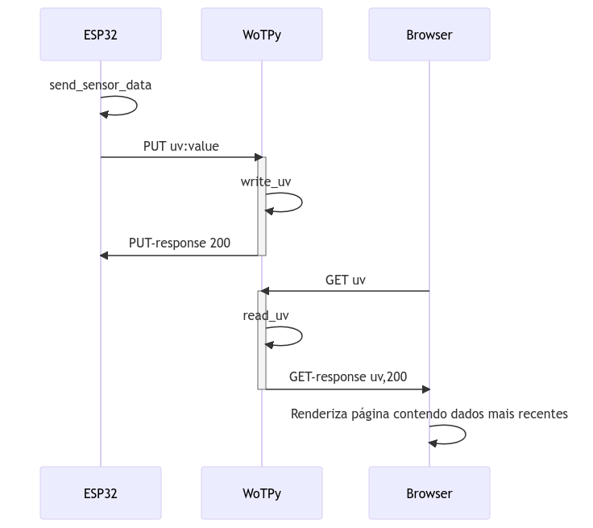

# UV Sensor Data Transmission with ESP32 and WoT

This project demonstrates transmitting UV sensor data from an ESP32 microcontroller to a Web of Things (WoT) server via the HTTP protocol. The project utilizes the WotPy library for server creation and WoT interactions and the ESP32 microcontroller paired with an ML8511 UV sensor.

Two main code files comprise this project: server.py and main.py. The server.py sets up the WoT server, exposes a Thing representing the UV sensor, and defines custom handlers for reading and writing UV sensor data. The main.py, running on the ESP32, periodically reads UV sensor data and sends it to the WoT server using HTTP requests.

To utilize this project, run the server.py file on your Python server and load the main.py file onto your ESP32. The ESP32 will continuously read UV sensor data and transmit it to the server, where it can be accessed and observed through the exposed Thing.

This project serves as a foundational example of integrating IoT devices with WoT principles, facilitating seamless communication and interoperability between devices and applications within a decentralized IoT ecosystem.

Feel free to customize and expand upon this project to suit your specific requirements and sensor configurations.

## Environment Setup

### WoT Server

This document assumes you have docker installed on your machine. If not, please visit the [official website](https://docs.docker.com/get-docker/) to install it.

First, execute the following commands in your terminal:
```sh
git clone https://github.com/T16K/wot-py.git
cd wot-py
docker build .
```

Now you've built an image from the Dockerfile. Next, check the IMAGE ID:
```sh
docker images
```

<!--- current image id for FN: 139996ce06b6 --->
Copy the characters in the IMAGE ID column and replace 'IMAGE_ID' in the following command:
```sh
docker container run --network host -it --rm --user t1k -v $PWD/examples/uv_sensor:/app 'IMAGE_ID' sh
```

We are now running a Docker container using the specified image with the host network stack, which provides interactive access to a shell session, and mounting the current working directory to the /asdf directory inside the container.

Finally, access the server.py file, and we have the server running:
```sh
cd examples/uv_sensor
python server.py
```

### ESP32

For detailed information, see this [document](https://t16k-ach2157.readthedocs.io/en/latest/comp/esp.html) in Portuguese.

## File Explanations

### server.py

- Importing the necessary libraries and modules:
```py
import json
import logging
import tornado.gen
from tornado.ioloop import IOLoop
from wotpy.protocols.http.server import HTTPServer
from wotpy.wot.servient import Servient
```

- Defining constants:
```py
HTTP_PORT = 9494
ID_THING = "urn:esp32"
UV_SENSOR = "uv"
```
The HTTP_PORT constant specifies the port on which the server will listen. ID_THING represents the identifier for the Thing, and UV_SENSOR is the name of the property representing the UV sensor.

- Global data storage:
```py
uv_data = None
```
This variable will store the latest UV sensor data received from the ESP32.

- Setting up [logging](https://docs.python.org/3/library/logging.html):
```py
logging.basicConfig()
logger = logging.getLogger()
logger.setLevel(logging.INFO)
```
Configuring the logger to display log messages with the level set to INFO.

- [Thing Description](https://www.w3.org/TR/wot-thing-description/):
```py
description = {
    "id": ID_THING,
    "name": ID_THING,
    "properties": {
        UV_SENSOR: {
            "type": "number",
            "readOnly": False,
            "observable": True
        }
    }
}
```
This dictionary represents the Thing description. It specifies the Thing's ID, name, and properties. In this case, it defines the UV_SENSOR property as a number type that can be read and observed.

- Custom handlers for reading and writing UV data:
```py
@tornado.gen.coroutine
def read_uv():
    if uv_data is None:
        return
    uv_data_dict = json.loads(uv_data.decode("utf-8"))
    return float(uv_data_dict['uv'])

@tornado.gen.coroutine
def write_uv(value):
    global uv_data
    uv_data = value
```
These two functions serve as custom handlers for reading and writing the UV sensor data. The read_uv function parses the stored UV data and returns it as a float. The write_uv function updates the uv_data variable with the received value.

`tornado.gen.coroutine`: This decorator is used to define a coroutine function in Tornado. It allows the function to be used with asynchronous programming. You can refer to the [Tornado documentation](https://www.tornadoweb.org/en/stable/gen.html) for more details.

`json.loads`: This method is used to parse a JSON string into a Python object. It is part of the Python JSON module. You can refer to the [Python JSON documentation](https://docs.python.org/3/library/json.html) for more details.

`uv_data.decode`: This method is used to decode a byte string into a Unicode string. It is a method of the bytes class in Python. You can refer to the [Python bytes documentation](https://docs.python.org/3/library/stdtypes.html#bytes.decode) for more details.

- Starting the server:
```py
@tornado.gen.coroutine
def start_server():
    http_server = HTTPServer(port=HTTP_PORT)
    servient = Servient()
    servient.add_server(http_server)
    wot = yield servient.start()
    exposed_thing = wot.produce(json.dumps(description))
    exposed_thing.set_property_read_handler(UV_SENSOR, read_uv)
    exposed_thing.set_property_write_handler(UV_SENSOR, write_uv)
    exposed_thing.expose()

if __name__ == "__main__":
    IOLoop.current().add_callback(start_server)
    IOLoop.current().start()
```
The start_server function creates an [HTTP server](https://agmangas.github.io/wot-py/http.html) using the specified port and initializes the [WotPy Servient](https://agmangas.github.io/wot-py/_autosummary/_wot/wotpy.wot.servient.html?highlight=servient#module-wotpy.wot.servient). It then starts the servient, produces the Thing based on the description, sets the custom read and write handlers for the UV property, and exposes the Thing. Finally, the server is started by adding the start_server function to the IOLoop.

`servient.add_server`: This method is used to add a server to the Servient instance. It is part of the WotPy library. You can refer to the [WotPy documentation](https://agmangas.github.io/wot-py/_autosummary/_wot/wotpy.wot.servient.html?highlight=servient%20add_server#wotpy.wot.servient.Servient.add_server) for more details.

`servient.start`: This method is used to start the Servient instance. It returns a future that resolves to a Wot object. It is part of the WotPy library. You can refer to the [WotPy documentation](https://agmangas.github.io/wot-py/_autosummary/_wot/wotpy.wot.servient.html?highlight=servient%20start#wotpy.wot.servient.Servient.start) for more details.

`wot.produce`: This method is used to produce a Thing instance from a Thing description. It is part of the WotPy library. You can refer to the [WotPy documentation](https://agmangas.github.io/wot-py/_autosummary/_wot/wotpy.wot.wot.html?highlight=wot%20produce#wotpy.wot.wot.WoT.produce) for more details.

`json.dumps`: This method is used to serialize a Python object into a JSON-formatted string. It is part of the Python JSON module. You can refer to the [Python JSON documentation](https://docs.python.org/3/library/json.html) for more details.

`exposed_thing.set_property_read_handler`: This method is used to set a custom read handler for a property of a Thing. It is part of the WotPy library. You can refer to the [WotPy documentation](https://agmangas.github.io/wot-py/_autosummary/_wot/_exposed/wotpy.wot.exposed.thing.html?highlight=set_property_write_handler#wotpy.wot.exposed.thing.ExposedThing.set_property_write_handler) for more details.

`exposed_thing.set_property_write_handler`: This method is used to set a custom write handler for a property of a Thing. It is part of the WotPy library. You can refer to the [WotPy documentation](https://agmangas.github.io/wot-py/_autosummary/_wot/_exposed/wotpy.wot.exposed.thing.html?highlight=set_property_write_handler#wotpy.wot.exposed.thing.ExposedThing.set_property_read_handler) for more details.

`exposed_thing.expose`: This method is used to expose a Thing. It makes the Thing available for interaction through the WoT interfaces. It is part of the WotPy library. You can refer to the [WotPy documentation](https://agmangas.github.io/wot-py/_autosummary/_wot/_exposed/wotpy.wot.exposed.thing.html?highlight=expose#wotpy.wot.exposed.thing.ExposedThing.expose) for more details.

### main.py

- Importing the necessary modules:
```py
import machine
import ujson
import urequests
import time
```

- Sensor setup:
```py
sensors = {
    'uv_sensor': {'type': 'uv', 'sensor': machine.ADC(machine.Pin(34))},
    # Add sensors as needed
}
```
This dictionary contains the sensor configurations. In this case, it defines an uv_sensor with its type as 'uv' and specifies the corresponding pin on the ESP32.

`machine.ADC`: This class is part of the MicroPython machine module and is used to configure and read values from an Analog-to-Digital Converter (ADC) channel. You can refer to the [MicroPython machine.ADC documentation](https://docs.micropython.org/en/latest/library/machine.ADC.html) for more details.

`machine.Pin`: This class is part of the MicroPython machine module and is used to configure and control GPIO pins. You can refer to the [MicroPython machine.Pin documentation](https://docs.micropython.org/en/latest/library/machine.Pin.html) for more details.

- Thing Description:
```py
TD = {
    'uv_sensor': {"links": [{"href": "http://000.000.0.00:9494/urn:esp32/property/uv"}]},
    # Add sensors as needed
}
```
The TD dictionary holds the descriptions of the Things. It contains a link to the UV sensor property on the server.

- Function to send sensor data to the server:
```py
def send_sensor_data(sensor_id, sensor_type, url, data):
    headers = {'content-type': 'application/json'}
    try:
        r = urequests.put(url.format(sensor_id), data=ujson.dumps(data), headers=headers)
        if r.status_code >= 200 and r.status_code < 300:
            print('Successfully sent {} data from {} to WoT server'.format(sensor_type, sensor_id))
        else:
            print('Failed to send {} data from {} to WoT server: received status code {}'.format(sensor_type, sensor_id, r.status_code))
        r.close()
    except Exception as e:
        print('Could not send {} data from {} to WoT server: '.format(sensor_type, sensor_id), e)
```
This function takes the sensor ID, type, URL, and data as input. It sends an HTTP PUT request to the server with the data payload in JSON format. It then prints a success or failure message based on the response status code.

`ujson.dumps`: This function is provided by the MicroPython ujson module and is used to serialize a Python object into a JSON-formatted string. You can refer to the [MicroPython ujson documentation](https://docs.micropython.org/en/latest/library/json.html) for more details.

`urequests.put`: This function is provided by the MicroPython urequests module and is used to send an HTTP PUT request. It is similar to the requests library in Python. You can refer to the [MicroPython urequests documentation](https://makeblock-micropython-api.readthedocs.io/en/latest/public_library/Third-party-libraries/urequests.html) for more details.

- Main function:
```
def main():
    while True:
        for sensor_id, sensor_info in sensors.items():
            sensor_value = sensor_info['sensor'].read()
            data = {sensor_info['type']: sensor_value}
            url = TD[sensor_id]['links'][0]['href']
            send_sensor_data(sensor_id, sensor_info['type'], url, data)
        time.sleep(5)

if __name__ == "__main__":
    main()
```

The main function is executed when the script is run. It enters an infinite loop and iterates through each sensor defined in the sensors dictionary. It reads the sensor value, creates a data object with the corresponding type, retrieves the URL from the Thing Description (TD), and calls the send_sensor_data function to send the data to the server. The loop waits for 5 seconds before repeating.

`time.sleep`: This function is part of the Python time module and is used to pause the execution of the program for a specified number of seconds. You can refer to the [Python time documentation](https://docs.python.org/3/library/time.html#time.sleep) for more details.

### boot.py

The boot.py file is a script that runs automatically when the ESP32 starts up. Its purpose is to [establish a Wi-Fi connection](https://docs.micropython.org/en/latest/esp32/quickref.html#networking) to the specified network, allowing the ESP32 to connect to the internet and communicate with the WoT server.

The code defines a function called `do_connect` that takes the SSID (network name) and password as arguments. Within the function, it imports the network module to manage the Wi-Fi connection.

The function checks if the ESP32 is already connected to a network using the `isconnected` method of the `STA_IF` interface (station interface). If the ESP32 is not connected, it proceeds to connect by activating the station interface `(active(True))` and calling the connect method with the provided SSID and password.

After initiating the connection, the code enters a loop that waits until the ESP32 successfully connects to the network (isconnected() returns True).

Once the connection is established, it prints the network configuration details (IP address, subnet mask, gateway, etc.) using the ifconfig method of the station interface.

To use this script, replace 'YourSSID' with the SSID of your Wi-Fi network and 'YourPassword' with the corresponding password.

By including this boot.py script on your ESP32, it will automatically connect to the specified Wi-Fi network upon startup, ensuring a reliable internet connection for your application.

Remember to upload the modified boot.py file to the ESP32 and verify that the network credentials are correct before deploying your project.

## Example (HTTP side)

Both ESP32-based device and web browser communicate to WotPy servient through port 9494.

Notice that ESP32-based device only sends information. It makes PUT requests to the servient (the request type is defined in WoT recommendation and implemented into WotPy). Also, the browser only receives information. It makes GET requests to the server (browse http://localhost:9494/urn:esp32/property/uv).

Figure 1: O dispositivo (ESP32) executa um loop que, a cada 5 segundos executa a função send\_sensor\_data. Esta função envia uma requisição PUT para o servidor (WoTPy). Em resposta a essa requisição o servidor executa o handler (função) write\_uv que contém o envio da resposta. Um usuário pode acessar a informação no servidor através do Browser. Entrar a URL na barra de endereços do Browser o faz enviar ao servidor uma requisição GET. Em resposta à requisição o servidor executa o handler (função) read\_uv, que contém o envio da resposta - no caso, o valor de uv mais recente. O Browser recebe essa informação e renderiza a página contendo a informação.



One can send data (simulate am ESP32-based device sending data) with cURL command: `curl -X PUT -H "Content-Type: application/json" -d '{"uv":"31"}' http://localhost:9494/urn:esp32/property/uv`


## Example (SPARQL side)

Link to SPARQL query page: http://localhost:8585/query

Link to SPARQL service:

A SPARQL query: `SELECT * WHERE {?S ?P ?O}`

